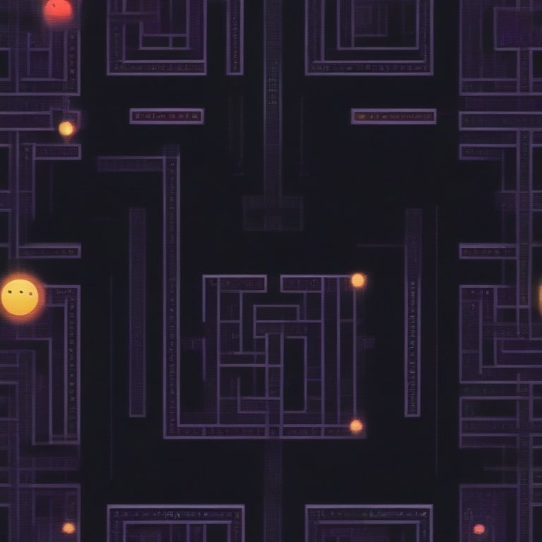

# Fresh Threads Design - Retro_Gaming Collection

## Generated Design Details

**Date Created**: 2025-08-04 23:10:36
**Theme**: Retro Gaming
**AI Pipeline**: DreamShaperXL Turbo + ControlNet Depth + Dolphin Llama 3

## Generated Images

  


## Prompt Details

### Main Prompt
```
The T-shirt design features a retro gaming theme inspired by Pac-Man's maze gameplay. The concept is centered around a pixelated maze made of bright neon colors on a dark background, reminiscent of 8-bit and synthwave aesthetics. The composition showcases a detailed maze design that fills the shirt's front, with the game's iconic characters strategically placed within the labyrinth. Typography should be bold and playful, using retro-style fonts like Commodore 64 or Game Boy. Avoid overly complicated compositions or color schemes that may not translate well to print-on-demand production.
```

### Negative Prompt
```
Common issues include poor resolution, unclear or pixelated graphics, and excessive clutter that makes it difficult to discern the main elements of the design. Elements that don't work well on T-shirts are complex vector art or highly detailed illustrations with lots of small details that may not reproduce well when printed.
```

### Technical Settings
- **Steps**: 6
- **CFG Scale**: 1.5
- **Sampler**: euler_ancestral
- **Resolution**: 768x768
- **ControlNet Strength**: 0.8
- **Preprocessing**: depth_midas

## Models Used
- **Checkpoint**: dreamshaper_xl_turbo.safetensors
- **LoRA**: LCM_LoRA_Weights_SD15.safetensors
- **ControlNet**: control_v11f1p_sd15_depth.pth

## Production Ready Features
- ✅ High resolution (768x768)
- ✅ Print-optimized settings
- ✅ ControlNet depth guidance
- ✅ LCM-LoRA for speed optimization
- ✅ Professional AI prompt engineering

## Next Steps
1. Review design quality
2. Test print compatibility
3. Upload to Printify/Printful
4. Begin marketing campaign

---
*Generated by Fresh Threads Advanced ComfyUI Pipeline*
