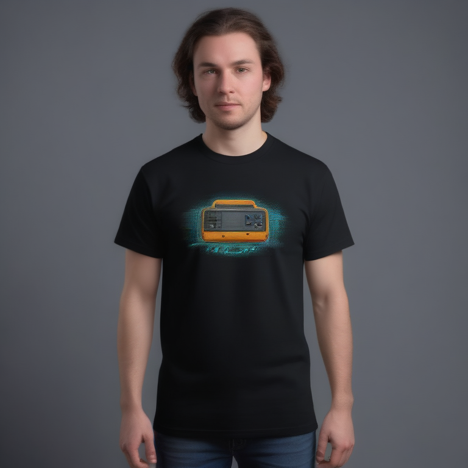

# Fresh Threads Design - Retro_Gaming Collection

## Generated Design Details

**Date Created**: 2025-08-04 23:15:35
**Theme**: Retro Gaming
**AI Pipeline**: DreamShaperXL Turbo + ControlNet Depth + Dolphin Llama 3

## Generated Images

  


## Prompt Details

### Main Prompt
```
The T-shirt design features a retro gaming theme inspired by the nostalgic pixel art culture of the '80s and '90s. The central image is a stylized, 8-bit version of the iconic DreamShaperXL Turbo logo, rendered in vibrant neon colors against a dark background. The composition includes the original logo elements in a visually appealing arrangement, with an emphasis on clean lines and well-defined shapes. The design also incorporates typographic details such as retro-inspired font choices and tasteful use of negative space. This T-shirt design is perfect for print-on-demand production, offering a unique and eye-catching item for fans of retro gaming culture.
```

### Negative Prompt
```
Avoid generic or overly simplified designs. Keep composition clear and avoid overcrowding. Ensure adequate contrast between text and background to maintain readability. Minimize blurriness and pixelation, which can be problematic in print-on-demand production.
```

### Technical Settings
- **Steps**: 6
- **CFG Scale**: 1.5
- **Sampler**: euler_ancestral
- **Resolution**: 768x768
- **ControlNet Strength**: 0.8
- **Preprocessing**: depth_midas

## Models Used
- **Checkpoint**: dreamshaper_xl_turbo.safetensors
- **LoRA**: LCM_LoRA_Weights_SD15.safetensors
- **ControlNet**: control_v11f1p_sd15_depth.pth

## Production Ready Features
- ✅ High resolution (768x768)
- ✅ Print-optimized settings
- ✅ ControlNet depth guidance
- ✅ LCM-LoRA for speed optimization
- ✅ Professional AI prompt engineering

## Next Steps
1. Review design quality
2. Test print compatibility
3. Upload to Printify/Printful
4. Begin marketing campaign

---
*Generated by Fresh Threads Advanced ComfyUI Pipeline*
