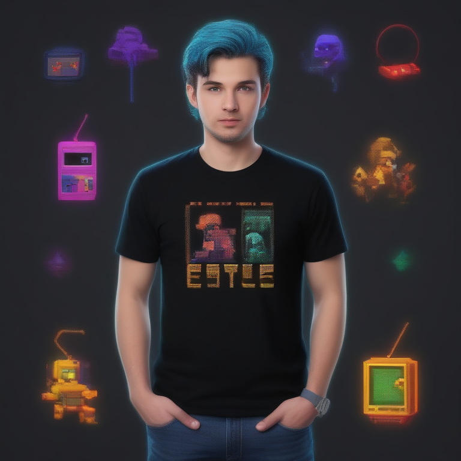

# Fresh Threads Design - Retro_Gaming Collection

## Generated Design Details

**Date Created**: 2025-08-04 23:18:31
**Theme**: Retro Gaming
**AI Pipeline**: DreamShaperXL Turbo + ControlNet Depth + Dolphin Llama 3

## Generated Images

  


## Prompt Details

### Main Prompt
```
A retro gaming-inspired T-shirt design featuring a pixel art character 'Level Up Your Style.' The concept focuses on nostalgic gaming culture with elements of iconic 8-bit pixel art and neon colors. This design includes characters playing classic video games in vibrant neon hues, set against dark backgrounds to emphasize the retro aesthetic. Typography should be clean and bold, utilizing graphic elements such as pixelated outlines or neon accents to enhance the overall style.
```

### Negative Prompt
```
Avoid overly complex designs that may not translate well to a T-shirt format. Poor quality indicators include low-resolution images, poor color balance, and cluttered compositions that are difficult to read at a glance.
```

### Technical Settings
- **Steps**: 6
- **CFG Scale**: 1.5
- **Sampler**: euler_ancestral
- **Resolution**: 768x768
- **ControlNet Strength**: 0.8
- **Preprocessing**: depth_midas

## Models Used
- **Checkpoint**: dreamshaper_xl_turbo.safetensors
- **LoRA**: LCM_LoRA_Weights_SD15.safetensors
- **ControlNet**: control_v11f1p_sd15_depth.pth

## Production Ready Features
- ✅ High resolution (768x768)
- ✅ Print-optimized settings
- ✅ ControlNet depth guidance
- ✅ LCM-LoRA for speed optimization
- ✅ Professional AI prompt engineering

## Next Steps
1. Review design quality
2. Test print compatibility
3. Upload to Printify/Printful
4. Begin marketing campaign

---
*Generated by Fresh Threads Advanced ComfyUI Pipeline*
