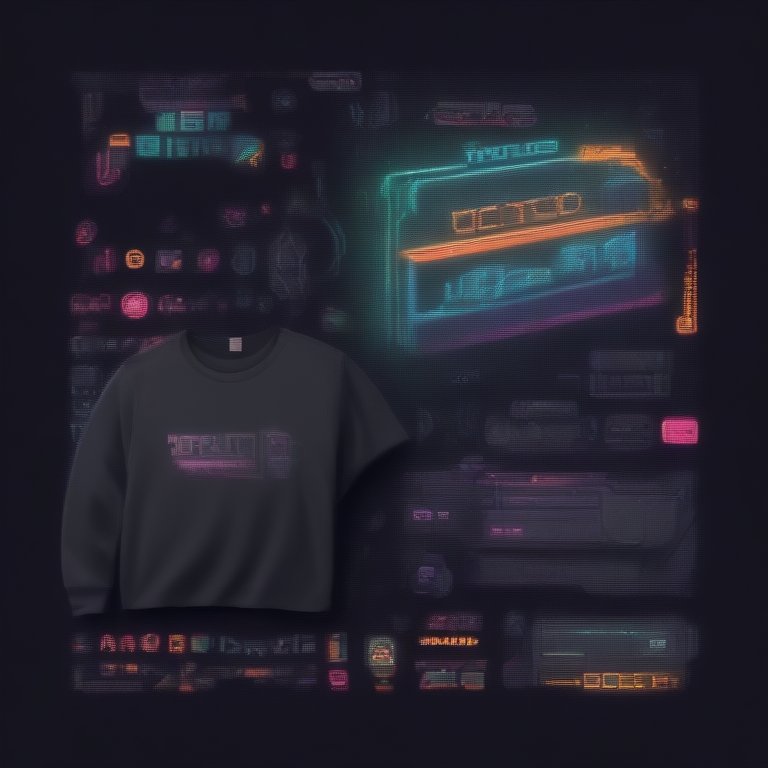

# Fresh Threads Design - Retro_Gaming Collection

## Generated Design Details

**Date Created**: 2025-08-04 23:29:11
**Theme**: Retro Gaming
**AI Pipeline**: DreamShaperXL Turbo + ControlNet Depth + Dolphin Llama 3

## Generated Images

  


## Prompt Details

### Main Prompt
```
A retro gaming inspired T-shirt design featuring pixel art elements and a nostalgic gaming culture theme. The concept is to 'Level Up Your Style' with a focus on 8-bit, neon, and synthwave style keywords. The color palette consists of vibrant neon colors on dark backgrounds. The T-shirt design should have an appealing composition that suits print-on-demand production, including specific visual elements such as retro gaming characters, consoles, or iconic pixel art designs. Typography should be bold yet playful to match the theme.
```

### Negative Prompt
```
Avoid common issues in AI-generated designs such as poor quality indicators, overly complex compositions, and low-resolution images. Ensure that the design works well on T-shirts, with appropriate color choices and legible typography.
```

### Technical Settings
- **Steps**: 6
- **CFG Scale**: 1.5
- **Sampler**: euler_ancestral
- **Resolution**: 768x768
- **ControlNet Strength**: 0.8
- **Preprocessing**: depth_midas

## Models Used
- **Checkpoint**: dreamshaper_xl_turbo.safetensors
- **LoRA**: LCM_LoRA_Weights_SD15.safetensors
- **ControlNet**: control_v11f1p_sd15_depth.pth

## Production Ready Features
- ✅ High resolution (768x768)
- ✅ Print-optimized settings
- ✅ ControlNet depth guidance
- ✅ LCM-LoRA for speed optimization
- ✅ Professional AI prompt engineering

## Next Steps
1. Review design quality
2. Test print compatibility
3. Upload to Printify/Printful
4. Begin marketing campaign

---
*Generated by Fresh Threads Advanced ComfyUI Pipeline*
