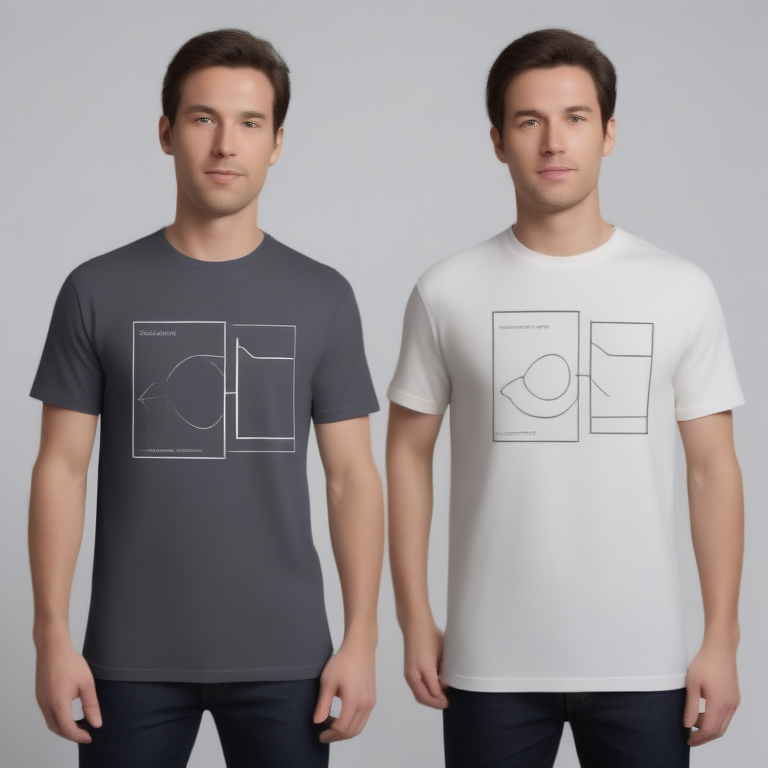

# Fresh Threads Design - Tech_Minimal Collection

## Generated Design Details

**Date Created**: 2025-08-04 23:08:08
**Theme**: Tech Minimal
**AI Pipeline**: DreamShaperXL Turbo + ControlNet Depth + Dolphin Llama 3

## Generated Images

  


## Prompt Details

### Main Prompt
```
The T-shirt design features a minimalist tech aesthetic, with clean typography and modern geometric elements. The monochromatic color palette is complemented by accent colors for added visual interest. The E = mc2 equation is prominently displayed using a sleek, sans-serif font in the top left corner of the shirt, surrounded by stylish abstract shapes that evoke the spirit of technology. This design is perfect for print-on-demand production and will appeal to tech enthusiasts who appreciate clean, modern style.
```

### Negative Prompt
```
Avoid overly complex designs, poor quality text rendering, and excessive use of accent colors. Ensure that the layout and typography are legible and visually appealing on a T-shirt. Steer clear of cluttered compositions and heavy graphic elements that may not translate well to the print-on-demand process.
```

### Technical Settings
- **Steps**: 6
- **CFG Scale**: 1.5
- **Sampler**: euler_ancestral
- **Resolution**: 768x768
- **ControlNet Strength**: 0.8
- **Preprocessing**: depth_ midas

## Models Used
- **Checkpoint**: dreamshaper_xl_turbo.safetensors
- **LoRA**: LCM_LoRA_Weights_SD15.safetensors
- **ControlNet**: control_v11f1p_sd15_depth.pth

## Production Ready Features
- ✅ High resolution (768x768)
- ✅ Print-optimized settings
- ✅ ControlNet depth guidance
- ✅ LCM-LoRA for speed optimization
- ✅ Professional AI prompt engineering

## Next Steps
1. Review design quality
2. Test print compatibility
3. Upload to Printify/Printful
4. Begin marketing campaign

---
*Generated by Fresh Threads Advanced ComfyUI Pipeline*
