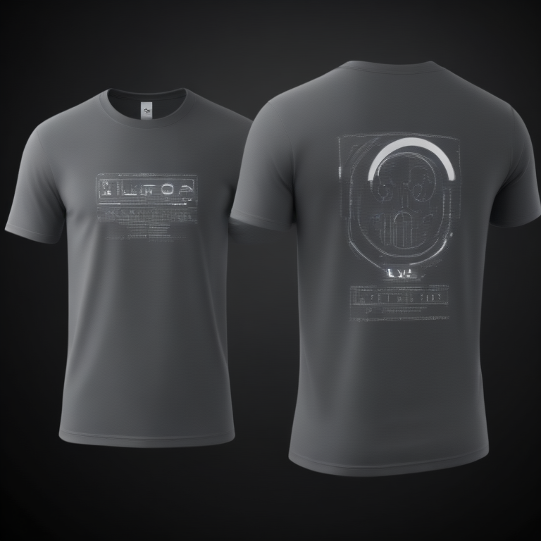

# Fresh Threads Design - Tech_Minimal Collection

## Generated Design Details

**Date Created**: 2025-08-04 23:21:19
**Theme**: Tech Minimal
**AI Pipeline**: DreamShaperXL Turbo + ControlNet Depth + Dolphin Llama 3

## Generated Images

  


## Prompt Details

### Main Prompt
```
Design a captivating T-shirt for DreamShaperXL Turbo featuring an LCM-LoRA Test-themed fast circuit design in a minimalist tech aesthetic with clean typography. The design should include geometric shapes and sleek lines, all rendered in a monochromatic color palette with accent colors for added depth. Typography should be modern and legible, maintaining a clean and simple look that works well on T-shirts.
```

### Negative Prompt
```
Avoid overly complex designs, low-quality imagery, and unprofessional typography. Keep the focus on minimalist tech aesthetics while avoiding cluttered layouts and excessive use of accent colors.
```

### Technical Settings
- **Steps**: 6
- **CFG Scale**: 1.5
- **Sampler**: euler_ancestral
- **Resolution**: 768x768
- **ControlNet Strength**: 0.8
- **Preprocessing**: depth_lasso

## Models Used
- **Checkpoint**: dreamshaper_xl_turbo.safetensors
- **LoRA**: LCM_LoRA_Weights_SD15.safetensors
- **ControlNet**: control_v11f1p_sd15_depth.pth

## Production Ready Features
- ✅ High resolution (768x768)
- ✅ Print-optimized settings
- ✅ ControlNet depth guidance
- ✅ LCM-LoRA for speed optimization
- ✅ Professional AI prompt engineering

## Next Steps
1. Review design quality
2. Test print compatibility
3. Upload to Printify/Printful
4. Begin marketing campaign

---
*Generated by Fresh Threads Advanced ComfyUI Pipeline*
