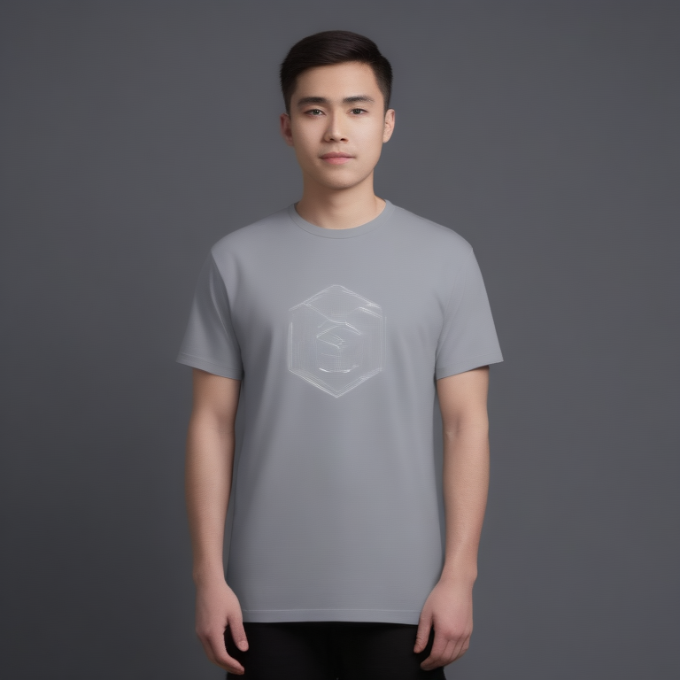

# Fresh Threads Design - Tech_Minimal Collection

## Generated Design Details

**Date Created**: 2025-08-04 23:28:42
**Theme**: Tech Minimal
**AI Pipeline**: DreamShaperXL Turbo + ControlNet Depth + Dolphin Llama 3

## Generated Images

  


## Prompt Details

### Main Prompt
```
Design a minimalist tech-inspired T-shirt for ComfyUI's DreamShaperXL Turbo, featuring a clean aesthetic and modern geometric shapes. The design should incorporate a monochromatic color palette with accent colors to create an eye-catching print-on-demand product. Typography should be easily readable and complement the overall theme of 'Error 404: Sleep Not Found.' Avoid overly complex compositions or elements that may not translate well onto a T-shirt.
```

### Negative Prompt
```
Common issues in AI-generated designs include low resolution, poor color choices, and unappealing compositions. Elements that don't work well on T-shirts might include intricate patterns or text-heavy designs. Poor quality indicators to avoid are blurriness, pixelation, and an overall lack of aesthetic appeal.
```

### Technical Settings
- **Steps**: 6
- **CFG Scale**: 1.5
- **Sampler**: euler_ancestral
- **Resolution**: 768x768
- **ControlNet Strength**: 0.8
- **Preprocessing**: depth_ midas

## Models Used
- **Checkpoint**: dreamshaper_xl_turbo.safetensors
- **LoRA**: LCM_LoRA_Weights_SD15.safetensors
- **ControlNet**: control_v11f1p_sd15_depth.pth

## Production Ready Features
- ✅ High resolution (768x768)
- ✅ Print-optimized settings
- ✅ ControlNet depth guidance
- ✅ LCM-LoRA for speed optimization
- ✅ Professional AI prompt engineering

## Next Steps
1. Review design quality
2. Test print compatibility
3. Upload to Printify/Printful
4. Begin marketing campaign

---
*Generated by Fresh Threads Advanced ComfyUI Pipeline*
