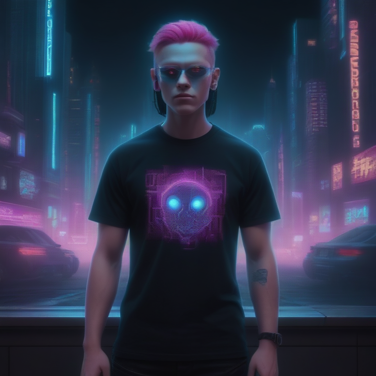

# Fresh Threads Design - Cyberpunk_Neon Collection

## Generated Design Details

**Date Created**: 2025-08-04 23:27:49
**Theme**: Cyberpunk Neon
**AI Pipeline**: DreamShaperXL Turbo + ControlNet Depth + Dolphin Llama 3

## Generated Images

  

## Prompt Details

### Main Prompt

```
Create a captivating cyberpunk-inspired T-shirt design featuring a digital ghost in the machine against a futuristic city backdrop, illuminated by neon lights. The design should evoke the essence of the original DreamShaperXL Turbo concept while incorporating electric blues, hot pinks, and acid greens on black. Focus on creating an eye-catching composition that utilizes bold typography and graphic elements reminiscent of classic cyberpunk aesthetics.
```

### Negative Prompt

```
Avoid overly busy designs, low-quality graphics, and poorly fitting typography. Ensure the image is suitable for print-on-demand production without any issues that could hinder its creation or sale.
```

### Technical Settings

- **Steps**: 6
- **CFG Scale**: 1.5
- **Sampler**: euler_ancestral
- **Resolution**: 768x768
- **ControlNet Strength**: 0.8
- **Preprocessing**: depth_midas

## Models Used

- **Checkpoint**: dreamshaper_xl_turbo.safetensors
- **LoRA**: LCM_LoRA_Weights_SD15.safetensors
- **ControlNet**: control_v11f1p_sd15_depth.pth

## Production Ready Features

- ✅ High resolution (768x768)
- ✅ Print-optimized settings
- ✅ ControlNet depth guidance
- ✅ LCM-LoRA for speed optimization
- ✅ Professional AI prompt engineering

## Next Steps

1. Review design quality
2. Test print compatibility
3. Upload to Printify/Printful
4. Begin marketing campaign

---
*Generated by Fresh Threads Advanced ComfyUI Pipeline*
