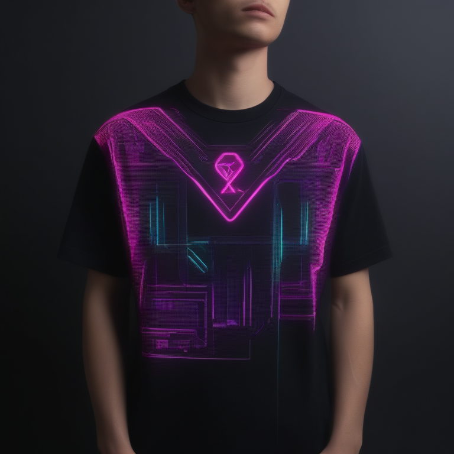

# Fresh Threads Design - Cyberpunk_Neon Collection

## Generated Design Details

**Date Created**: 2025-08-04 23:28:56
**Theme**: Cyberpunk Neon
**AI Pipeline**: DreamShaperXL Turbo + ControlNet Depth + Dolphin Llama 3

## Generated Images

  

## Prompt Details

### Main Prompt

```
The T-shirt design features a futuristic cyberpunk aesthetic with neon lighting. The composition showcases a sleek black background with electric blues, hot pinks, and acid greens neon elements arranged in a visually striking pattern. Typography should be bold and modern, complementing the overall style while being easily readable. Avoid overly complex graphics or elements that may not translate well to print-on-demand production.
```

### Negative Prompt

```
Avoid low-quality designs, poor color choices, and overcrowded compositions. Ensure that the design is optimized for print-on-demand production.
```

### Technical Settings

- **Steps**: 6
- **CFG Scale**: 1.5
- **Sampler**: euler_ancestral
- **Resolution**: 768x768
- **ControlNet Strength**: 0.8
- **Preprocessing**: depth_midas

## Models Used

- **Checkpoint**: dreamshaper_xl_turbo.safetensors
- **LoRA**: LCM_LoRA_Weights_SD15.safetensors
- **ControlNet**: control_v11f1p_sd15_depth.pth

## Production Ready Features

- ✅ High resolution (768x768)
- ✅ Print-optimized settings
- ✅ ControlNet depth guidance
- ✅ LCM-LoRA for speed optimization
- ✅ Professional AI prompt engineering

## Next Steps

1. Review design quality
2. Test print compatibility
3. Upload to Printify/Printful
4. Begin marketing campaign

---
*Generated by Fresh Threads Advanced ComfyUI Pipeline*
