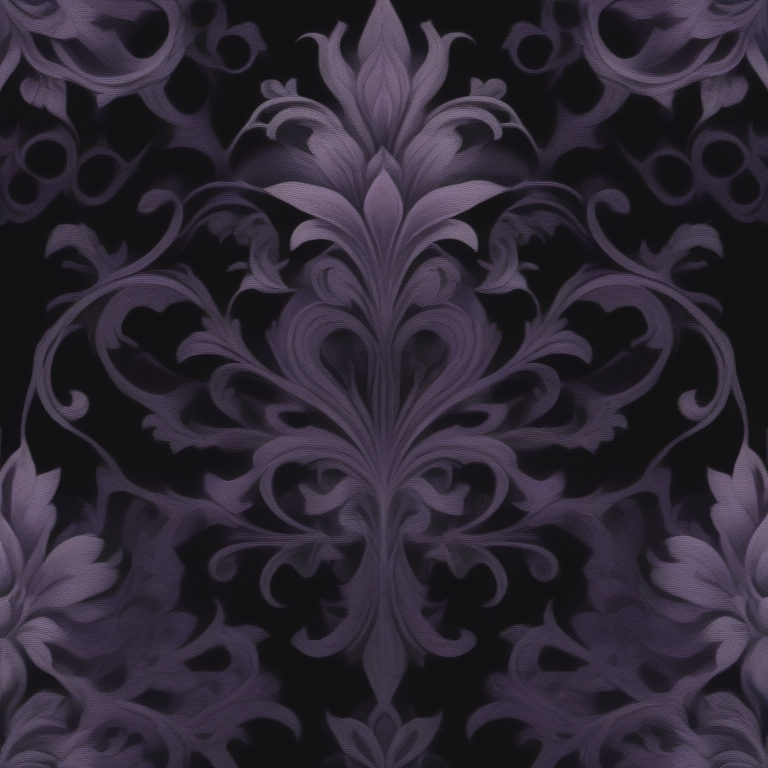

# Fresh Threads Design - Gothic_Dark Collection

## Generated Design Details

**Date Created**: 2025-08-04 23:33:00
**Theme**: Gothic Dark
**AI Pipeline**: DreamShaperXL Turbo + ControlNet Depth + Dolphin Llama 3

## Generated Images

  

## Prompt Details

### Main Prompt

```
A dark romantic gothic T-shirt design featuring a mysterious, ornate floral pattern with dramatic lines and deep black, purple, and silver color palette. The composition includes a central focal point surrounded by negative space, creating an elegant and captivating image that would be perfect for print-on-demand production.
```

### Negative Prompt

```
Avoid overly busy designs, poor resolution, low-quality typography, and excessive use of bright colors or cartoonish elements. Focus on maintaining a high-quality gothic aesthetic with a balance of ornate and mysterious design elements.
```

### Technical Settings

- **Steps**: 6
- **CFG Scale**: 1.5
- **Sampler**: euler_ancestral
- **Resolution**: 768x768
- **ControlNet Strength**: 0.8
- **Preprocessing**: depth_midas

## Models Used

- **Checkpoint**: dreamshaper_xl_turbo.safetensors
- **LoRA**: LCM_LoRA_Weights_SD15.safetensors
- **ControlNet**: control_v11f1p_sd15_depth.pth

## Production Ready Features

- ✅ High resolution (768x768)
- ✅ Print-optimized settings
- ✅ ControlNet depth guidance
- ✅ LCM-LoRA for speed optimization
- ✅ Professional AI prompt engineering

## Next Steps

1. Review design quality
2. Test print compatibility
3. Upload to Printify/Printful
4. Begin marketing campaign

---
*Generated by Fresh Threads Advanced ComfyUI Pipeline*
