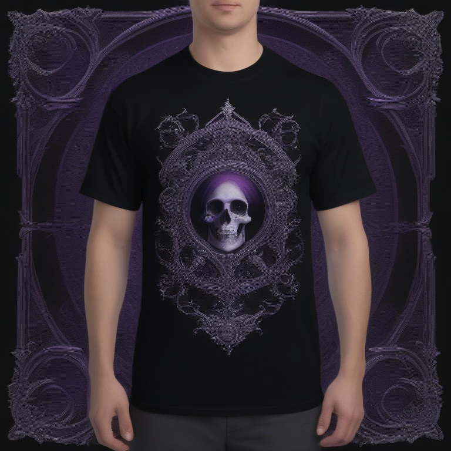

# Fresh Threads Design - Gothic_Dark Collection

## Generated Design Details

**Date Created**: 2025-08-05 00:13:01
**Theme**: Gothic Dark
**AI Pipeline**: DreamShaperXL Turbo + ControlNet Depth + Dolphin Llama 3

## Generated Images

  

## Prompt Details

### Main Prompt

```
Create a T-shirt design featuring a dark gothic aesthetic with mysterious elements for DreamShaperXL Turbo. The design should include ornate and dramatic visuals set against deep blacks, dark purples, and silver accents. Typography should be bold yet elegant, complementing the overall style of the image. Ensure that the composition is visually appealing and suitable for print-on-demand production.
```

### Negative Prompt

```
Avoid designs with low resolution, poor color choices, unbalanced compositions, or overly simplified graphics. Keep the focus on creating a mysterious and evocative atmosphere while maintaining professional standards.
```

### Technical Settings

- **Steps**: 6
- **CFG Scale**: 1.5
- **Sampler**: euler_ancestral
- **Resolution**: 768x768
- **ControlNet Strength**: 0.8
- **Preprocessing**: depth_midas

## Models Used

- **Checkpoint**: dreamshaper_xl_turbo.safetensors
- **LoRA**: LCM_LoRA_Weights_SD15.safetensors
- **ControlNet**: control_v11f1p_sd15_depth.pth

## Production Ready Features

- ✅ High resolution (768x768)
- ✅ Print-optimized settings
- ✅ ControlNet depth guidance
- ✅ LCM-LoRA for speed optimization
- ✅ Professional AI prompt engineering

## Next Steps

1. Review design quality
2. Test print compatibility
3. Upload to Printify/Printful
4. Begin marketing campaign

---
*Generated by Fresh Threads Advanced ComfyUI Pipeline*
