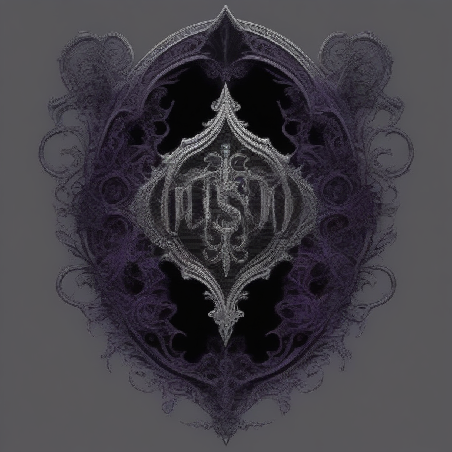

# Fresh Threads Design - Gothic_Dark Collection

## Generated Design Details

**Date Created**: 2025-08-05 00:15:53
**Theme**: Gothic Dark
**AI Pipeline**: DreamShaperXL Turbo + ControlNet Depth + Dolphin Llama 3

## Generated Images

  

## Prompt Details

### Main Prompt

```
Create a visually striking T-shirt design featuring a dark gothic aesthetic with mysterious elements inspired by the USA. The design should include intricate ornate patterns and dramatic compositions set against deep blacks, dark purples, and silver accents. Typography should be bold and eye-catching, ensuring high print quality suitable for on-demand production.
```

### Negative Prompt

```
Avoid generic or overly simplified designs, low-quality graphics, and elements that don't work well on T-shirts such as poor legibility or excessive detail.
```

### Technical Settings

- **Steps**: 6
- **CFG Scale**: 1.5
- **Sampler**: euler_ancestral
- **Resolution**: 768x768
- **ControlNet Strength**: 0.8
- **Preprocessing**: depth_midas

## Models Used

- **Checkpoint**: dreamshaper_xl_turbo.safetensors
- **LoRA**: LCM_LoRA_Weights_SD15.safetensors
- **ControlNet**: control_v11f1p_sd15_depth.pth

## Production Ready Features

- ✅ High resolution (768x768)
- ✅ Print-optimized settings
- ✅ ControlNet depth guidance
- ✅ LCM-LoRA for speed optimization
- ✅ Professional AI prompt engineering

## Next Steps

1. Review design quality
2. Test print compatibility
3. Upload to Printify/Printful
4. Begin marketing campaign

---
*Generated by Fresh Threads Advanced ComfyUI Pipeline*
