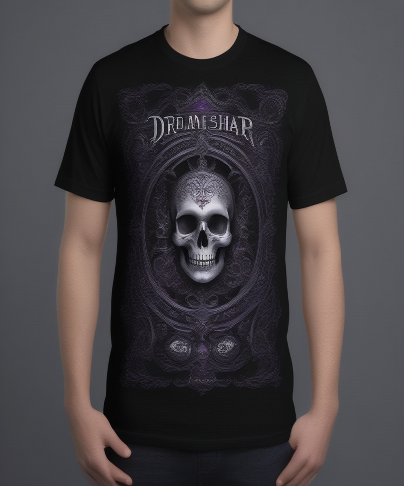

# Fresh Threads Design - Gothic_Dark Collection

## Generated Design Details

**Date Created**: 2025-08-08 15:26:04
**Theme**: Gothic Dark
**AI Pipeline**: DreamShaperXL Turbo + ControlNet Depth + Dolphin Llama 3

## Generated Images

  


## Prompt Details

### Main Prompt
```
Create a stunning T-shirt design for DreamShaperXL Turbo featuring a dark gothic aesthetic with mysterious elements. The composition should include intricate ornate patterns and dramatic lighting. Use deep blacks, dark purples, and silver accents in the color palette. Typography should be bold and striking, complementing the graphic elements without overpowering them. Ensure the final image is of high quality and suitable for print-on-demand production.
```

### Negative Prompt
```
Avoid low-quality designs with pixelated or blurry images. Don't use garish colors or overly complicated compositions that might not translate well to a T-shirt design.
```

### Technical Settings
- **Steps**: 6
- **CFG Scale**: 1.5
- **Sampler**: euler_ancestral
- **Resolution**: 768x768
- **ControlNet Strength**: 0.8
- **Preprocessing**: depth_ midas

## Models Used
- **Checkpoint**: dreamshaper_xl_turbo.safetensors
- **LoRA**: LCM_LoRA_Weights_SD15.safetensors
- **ControlNet**: control_v11f1p_sd15_depth.pth

## Production Ready Features
- ✅ High resolution (768x768)
- ✅ Print-optimized settings
- ✅ ControlNet depth guidance
- ✅ LCM-LoRA for speed optimization
- ✅ Professional AI prompt engineering

## Next Steps
1. Review design quality
2. Test print compatibility
3. Upload to Printify/Printful
4. Begin marketing campaign

---
*Generated by Fresh Threads Advanced ComfyUI Pipeline*
