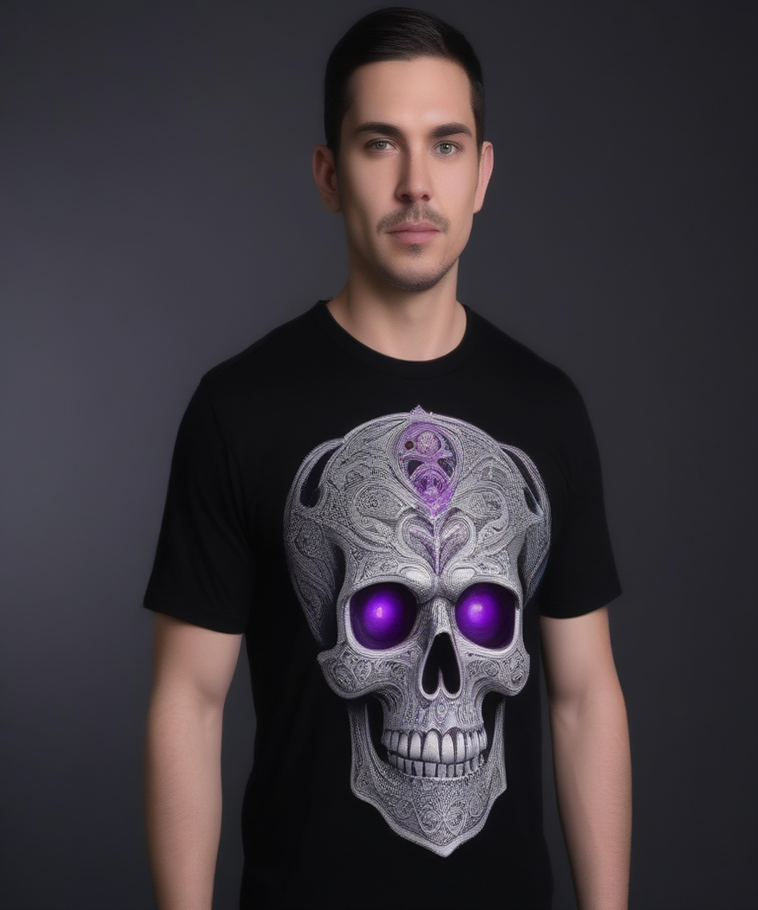

# Fresh Threads Design - Gothic_Dark Collection

## Generated Design Details

**Date Created**: 2025-08-08 15:39:46
**Theme**: Gothic Dark
**AI Pipeline**: DreamShaperXL Turbo + ControlNet Depth + Dolphin Llama 3

## Generated Images

  


## Prompt Details

### Main Prompt
```
A dark gothic T-shirt design featuring a detailed ornate silver skull with glowing purple eyes set against a deep black background. Intricate patterns reminiscent of ancient runes and Celtic knotwork adorn the skull's surface. The word 'Embrace the Shadows' is written in a bold, elegant gothic font below the skull, using silver accents that shimmer subtly. The design is centered on the T-shirt for optimal visual impact.
```

### Negative Prompt
```
blurry, distorted, low resolution, out of focus, text too small, text overlapping, unrealistic textures, disproportioned elements, cropped, poor composition, amateurish, ugly, bland, generic
```

### Technical Settings
- **Steps**: 6
- **CFG Scale**: 1.5
- **Sampler**: euler_ancestral
- **Resolution**: 768x768
- **ControlNet Strength**: 0.8
- **Preprocessing**: depth_midas

## Models Used
- **Checkpoint**: dreamshaper_xl_turbo.safetensors
- **LoRA**: LCM_LoRA_Weights_SD15.safetensors
- **ControlNet**: control_v11f1p_sd15_depth.pth

## Production Ready Features
- ✅ High resolution (768x768)
- ✅ Print-optimized settings
- ✅ ControlNet depth guidance
- ✅ LCM-LoRA for speed optimization
- ✅ Professional AI prompt engineering

## Next Steps
1. Review design quality
2. Test print compatibility
3. Upload to Printify/Printful
4. Begin marketing campaign

---
*Generated by Fresh Threads Advanced ComfyUI Pipeline*
