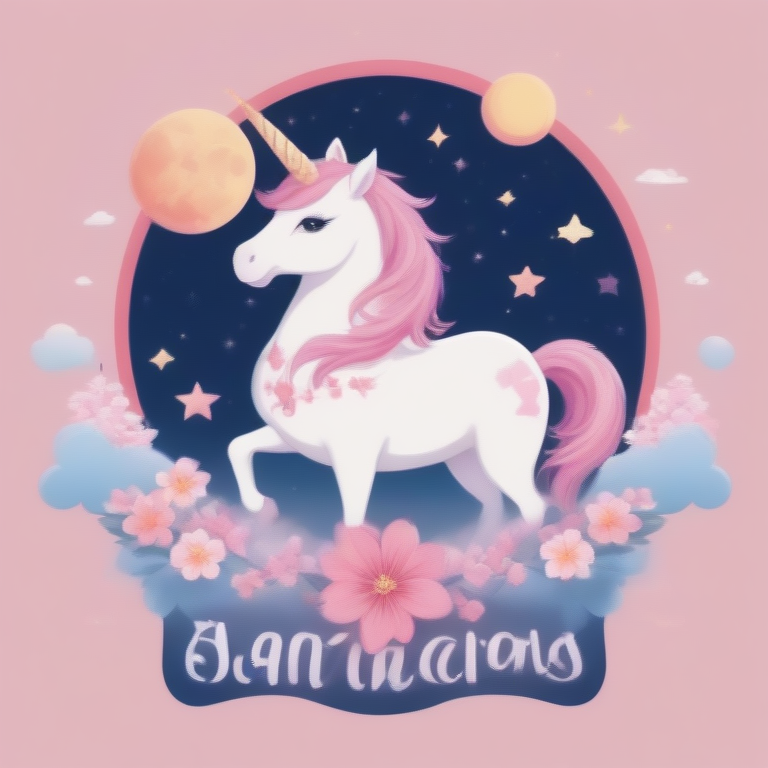

# Fresh Threads Design - Kawaii_Cute Collection

## Generated Design Details

**Date Created**: 2025-08-04 23:28:14
**Theme**: Kawaii Cute
**AI Pipeline**: DreamShaperXL Turbo + ControlNet Depth + Dolphin Llama 3

## Generated Images

  

## Prompt Details

### Main Prompt

```
For DreamShaperXL Turbo, create a T-shirt design featuring a magical unicorn surrounded by cute, kawaii elements from Japanese culture. The unicorn should have an adorable, pastel-colored body and a cheerful expression. In the background, incorporate elements like cherry blossoms, clouds, and a bright pink moon. Use kawaii typography for the text "Magical Unicorn Dreams" in a soft, rounded font. Ensure the design is balanced and visually appealing, with a focus on print-ondemand production quality.
```

### Negative Prompt

```
Avoid overly complex compositions, low-quality graphics, and unappealing color palettes. Keep typography legible and well-spaced for easy reading. Maintain a consistent style throughout the design.
```

### Technical Settings

- **Steps**: 6
- **CFG Scale**: 1.5
- **Sampler**: euler_ancestral
- **Resolution**: 768x768
- **ControlNet Strength**: 0.8
- **Preprocessing**: depth_midas

## Models Used

- **Checkpoint**: dreamshaper_xl_turbo.safetensors
- **LoRA**: LCM_LoRA_Weights_SD15.safetensors
- **ControlNet**: control_v11f1p_sd15_depth.pth

## Production Ready Features

- ✅ High resolution (768x768)
- ✅ Print-optimized settings
- ✅ ControlNet depth guidance
- ✅ LCM-LoRA for speed optimization
- ✅ Professional AI prompt engineering

## Next Steps

1. Review design quality
2. Test print compatibility
3. Upload to Printify/Printful
4. Begin marketing campaign

---
*Generated by Fresh Threads Advanced ComfyUI Pipeline*
