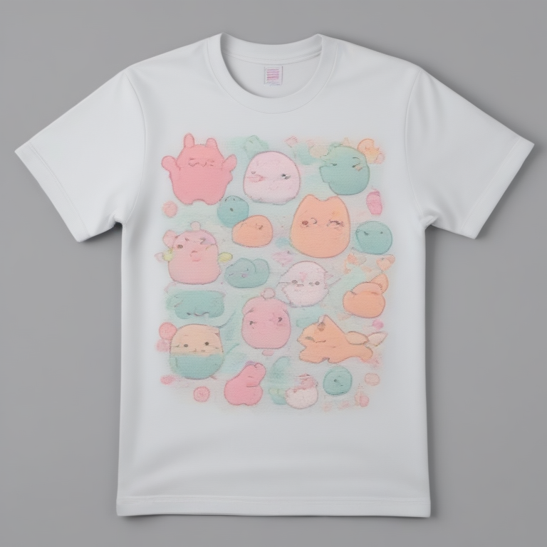

# Fresh Threads Design - Kawaii_Cute Collection

## Generated Design Details

**Date Created**: 2025-08-04 23:29:40
**Theme**: Kawaii Cute
**AI Pipeline**: DreamShaperXL Turbo + ControlNet Depth + Dolphin Llama 3

## Generated Images

  

## Prompt Details

### Main Prompt

```
Design a T-shirt featuring kawaii and cute Japanese-inspired characters in pastel colors, with cheerful expressions. The composition should showcase multiple adorable creatures interacting or engaging in activities that embody kawaii culture. Use typography that complements the aesthetic and avoid overly complex designs or unnecessary details. Ensure the final image is of high quality and suitable for print-on-demand production.
```

### Negative Prompt

```
Avoid low-quality images, overly busy compositions, and poor color choices. Steer clear of designs with harsh lines or aggressive characters, as these don't align with the kawaii vibe. Keep typography simple and readable.
```

### Technical Settings

- **Steps**: 6
- **CFG Scale**: 1.5
- **Sampler**: euler_ancestral
- **Resolution**: 768x768
- **ControlNet Strength**: 0.8
- **Preprocessing**: depth_ midas

## Models Used

- **Checkpoint**: dreamshaper_xl_turbo.safetensors
- **LoRA**: LCM_LoRA_Weights_SD15.safetensors
- **ControlNet**: control_v11f1p_sd15_depth.pth

## Production Ready Features

- ✅ High resolution (768x768)
- ✅ Print-optimized settings
- ✅ ControlNet depth guidance
- ✅ LCM-LoRA for speed optimization
- ✅ Professional AI prompt engineering

## Next Steps

1. Review design quality
2. Test print compatibility
3. Upload to Printify/Printful
4. Begin marketing campaign

---
*Generated by Fresh Threads Advanced ComfyUI Pipeline*
