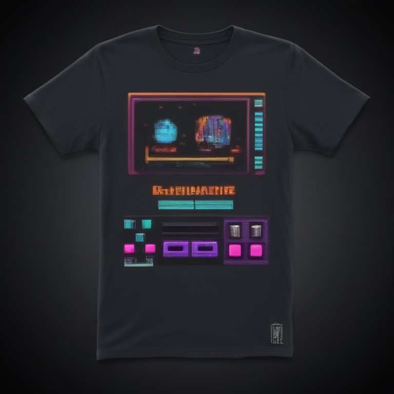

# Fresh Threads Design - Retro_Gaming Collection

## Generated Design Details

**Date Created**: 2025-08-04 23:02:55
**Theme**: Retro Gaming
**AI Pipeline**: DreamShaperXL Turbo + ControlNet Depth + Dolphin Llama 3

## Generated Images

  

## Prompt Details

### Main Prompt

```
Create a retro gaming-inspired T-shirt design featuring pixel art elements and neon color palette for ComfyUI image generation. The concept is 'Level Up Your Style' and should evoke nostalgic gaming culture with a modern twist. Incorporate 8-bit graphics, vibrant neon colors, and dark backgrounds to attract the target audience of young gamers. Utilize bold typography that complements the design theme while ensuring print quality for on-demand production.
```

### Negative Prompt

```
Avoid low-quality designs, poorly executed typography, and unbalanced color schemes. Ensure proper resolution and clarity in the final image, avoiding blurriness or pixelation when scaled up for printing.
```

### Technical Settings

- **Steps**: 6
- **CFG Scale**: 1.5
- **Sampler**: euler_ancestral
- **Resolution**: 768x768
- **ControlNet Strength**: 0.8
- **Preprocessing**: depth_midas

## Models Used

- **Checkpoint**: dreamshaper_xl_turbo.safetensors
- **LoRA**: LCM_LoRA_Weights_SD15.safetensors
- **ControlNet**: control_v11f1p_sd15_depth.pth

## Production Ready Features

- ✅ High resolution (768x768)
- ✅ Print-optimized settings
- ✅ ControlNet depth guidance
- ✅ LCM-LoRA for speed optimization
- ✅ Professional AI prompt engineering

## Next Steps

1. Review design quality
2. Test print compatibility
3. Upload to Printify/Printful
4. Begin marketing campaign

---
*Generated by Fresh Threads Advanced ComfyUI Pipeline*
