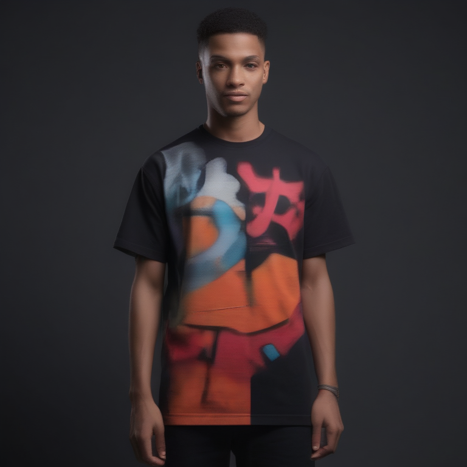

# Fresh Threads Design - Streetwear_Urban Collection

## Generated Design Details

**Date Created**: 2025-08-04 23:03:10
**Theme**: Streetwear Urban
**AI Pipeline**: DreamShaperXL Turbo + ControlNet Depth + Dolphin Llama 3

## Generated Images

  

## Prompt Details

### Main Prompt

```
The T-shirt design features a bold and eye-catching urban streetwear theme, inspired by graffiti and contemporary art styles. The composition consists of a large, central graphic element that fills most of the front, surrounded by smaller, equally bold graphics placed asymmetrically around it. Typography should be minimalistic and modern, with clean lines that complement the overall design aesthetic. The color palette is high contrast, utilizing bright accent colors against a dark background to create a visually striking image suitable for print-on-demand production.
```

### Negative Prompt

```
Avoid overly complex compositions or visual elements that may not translate well onto a T-shirt design. Ensure the quality of the generated image by avoiding low-resolution graphics, poor color choices, and unprofessional typography.
```

### Technical Settings

- **Steps**: 6
- **CFG Scale**: 1.5
- **Sampler**: euler_ancestral
- **Resolution**: 768x768
- **ControlNet Strength**: 0.8
- **Preprocessing**: depth_ort

## Models Used

- **Checkpoint**: dreamshaper_xl_turbo.safetensors
- **LoRA**: LCM_LoRA_Weights_SD15.safetensors
- **ControlNet**: control_v11f1p_sd15_depth.pth

## Production Ready Features

- ✅ High resolution (768x768)
- ✅ Print-optimized settings
- ✅ ControlNet depth guidance
- ✅ LCM-LoRA for speed optimization
- ✅ Professional AI prompt engineering

## Next Steps

1. Review design quality
2. Test print compatibility
3. Upload to Printify/Printful
4. Begin marketing campaign

---
*Generated by Fresh Threads Advanced ComfyUI Pipeline*
