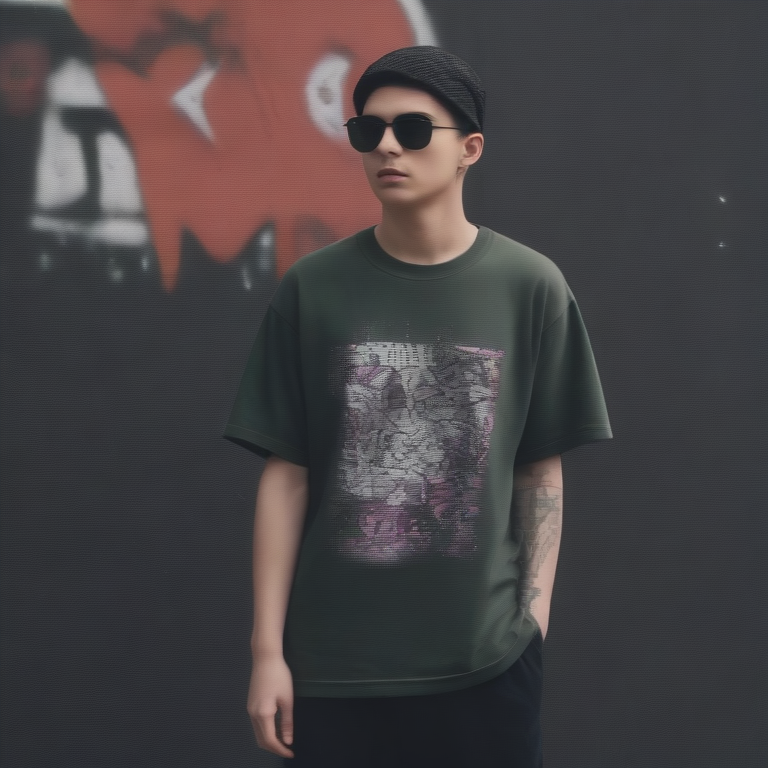

# Fresh Threads Design - Streetwear_Urban Collection

## Generated Design Details

**Date Created**: 2025-08-04 23:15:49
**Theme**: Streetwear Urban
**AI Pipeline**: DreamShaperXL Turbo + ControlNet Depth + Dolphin Llama 3

## Generated Images

  

## Prompt Details

### Main Prompt

```
Create a bold and fresh urban streetwear design for ComfyUI featuring graffiti-style graphics and contemporary elements. The T-shirt should have a high contrast color palette with bold accent colors. Design a unique composition that showcases the urban streetwear aesthetic while maintaining readability of any text. Avoid low-quality images, poorly executed typography, and overuse of graphic elements that don't work well on T-shirts.
```

### Negative Prompt

```
Common issues include poor image resolution, lack of contrast in color palette, low-quality typography, and excessive use of graphic elements. Ensure the design is suitable for print-on-demand production without compromising quality or readability.
```

### Technical Settings

- **Steps**: 6
- **CFG Scale**: 1.5
- **Sampler**: euler_ancestral
- **Resolution**: 768x768
- **ControlNet Strength**: 0.8
- **Preprocessing**: depth_ midas

## Models Used

- **Checkpoint**: dreamshaper_xl_turbo.safetensors
- **LoRA**: LCM_LoRA_Weights_SD15.safetensors
- **ControlNet**: control_v11f1p_sd15_depth.pth

## Production Ready Features

- ✅ High resolution (768x768)
- ✅ Print-optimized settings
- ✅ ControlNet depth guidance
- ✅ LCM-LoRA for speed optimization
- ✅ Professional AI prompt engineering

## Next Steps

1. Review design quality
2. Test print compatibility
3. Upload to Printify/Printful
4. Begin marketing campaign

---
*Generated by Fresh Threads Advanced ComfyUI Pipeline*
