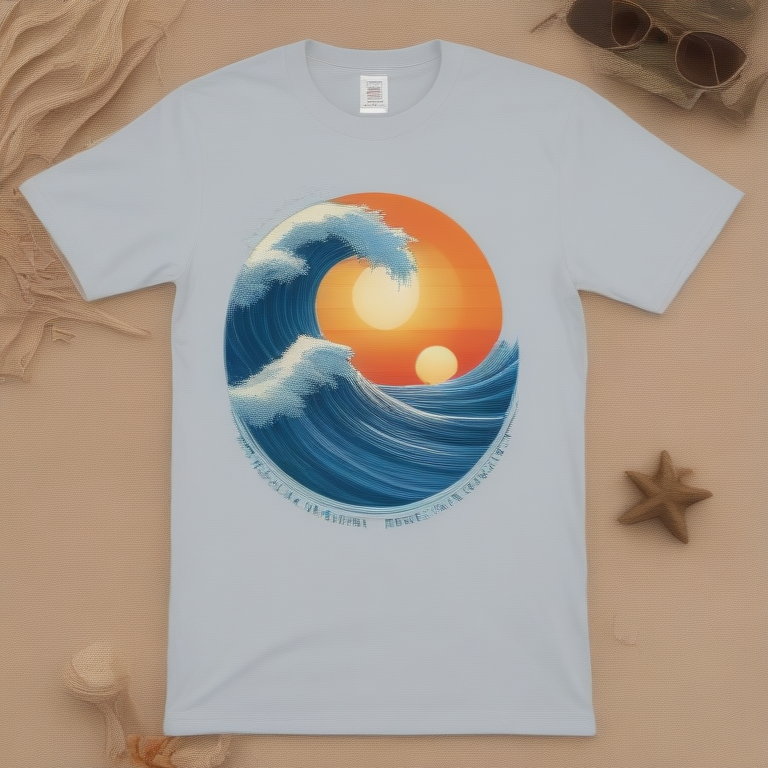

# Fresh Threads Design - Surf_Beach Collection

## Generated Design Details

**Date Created**: 2025-08-04 23:29:56
**Theme**: Surf Beach
**AI Pipeline**: DreamShaperXL Turbo + ControlNet Depth + Dolphin Llama 3

## Generated Images

  

## Prompt Details

### Main Prompt

```
A T-shirt design featuring a stunning ocean wave scene, evoking the spirit of surf culture and beach lifestyle. The image showcases a serene beachscape with crystal clear water, perfect waves for surfing, and a vibrant sun setting behind it all. The composition is simple yet striking, focusing on the beautiful natural elements while maintaining a clean and modern aesthetic. A bold font displays the phrase 'Ride the Waves' in a stylish yet readable way. The color palette consists of ocean blues, sandy beiges, and sunset oranges, creating an inviting atmosphere. This T-shirt design is perfect for print-on-demand production, appealing to those who love the beach, surfing, and the great outdoors.
```

### Negative Prompt

```
Avoid overly complicated designs or elements that don't work well on a T-shirt such as small text or detailed illustrations. Poor quality indicators include pixelated images or low-resolution visuals.
```

### Technical Settings

- **Steps**: 6
- **CFG Scale**: 1.5
- **Sampler**: euler_ancestral
- **Resolution**: 768x768
- **ControlNet Strength**: 0.8
- **Preprocessing**: depth_ midas

## Models Used

- **Checkpoint**: dreamshaper_xl_turbo.safetensors
- **LoRA**: LCM_LoRA_Weights_SD15.safetensors
- **ControlNet**: control_v11f1p_sd15_depth.pth

## Production Ready Features

- ✅ High resolution (768x768)
- ✅ Print-optimized settings
- ✅ ControlNet depth guidance
- ✅ LCM-LoRA for speed optimization
- ✅ Professional AI prompt engineering

## Next Steps

1. Review design quality
2. Test print compatibility
3. Upload to Printify/Printful
4. Begin marketing campaign

---
*Generated by Fresh Threads Advanced ComfyUI Pipeline*
