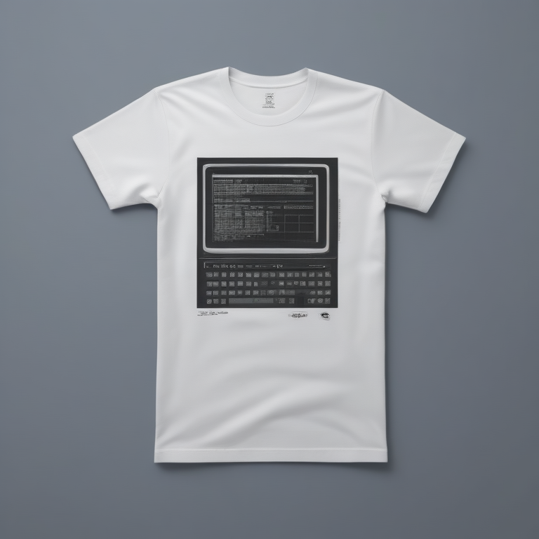

# Fresh Threads Design - Tech_Minimal Collection

## Generated Design Details

**Date Created**: 2025-08-04 23:02:40
**Theme**: Tech Minimal
**AI Pipeline**: DreamShaperXL Turbo + ControlNet Depth + Dolphin Llama 3

## Generated Images

  

## Prompt Details

### Main Prompt

```
Design a minimalist T-shirt for developers featuring an 'Error 404: Sleep Not Found' theme. The design should incorporate clean typography and a modern geometric style with monochromatic colors and accent hues. Include an illustration of a computer screen displaying the error message, surrounded by circuit board patterns or similar technological elements. Use bold, legible typefaces for the text 'Error 404: Sleep Not Found' and any additional descriptive or humorous text on the back. Ensure the design is suitable for print-on-demand production.
```

### Negative Prompt

```
Avoid using low-quality graphics, poorly chosen color combinations, or cluttered layouts that may distract from the main concept. Refrain from using copyrighted material without permission.
```

### Technical Settings

- **Steps**: 6
- **CFG Scale**: 1.5
- **Sampler**: euler_ancestral
- **Resolution**: 768x768
- **ControlNet Strength**: 0.8
- **Preprocessing**: depth_midas

## Models Used

- **Checkpoint**: dreamshaper_xl_turbo.safetensors
- **LoRA**: LCM_LoRA_Weights_SD15.safetensors
- **ControlNet**: control_v11f1p_sd15_depth.pth

## Production Ready Features

- ✅ High resolution (768x768)
- ✅ Print-optimized settings
- ✅ ControlNet depth guidance
- ✅ LCM-LoRA for speed optimization
- ✅ Professional AI prompt engineering

## Next Steps

1. Review design quality
2. Test print compatibility
3. Upload to Printify/Printful
4. Begin marketing campaign

---
*Generated by Fresh Threads Advanced ComfyUI Pipeline*
